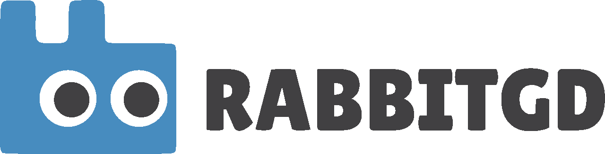

# RabbitGD - Godot 4 RabbitMQ Client Library



## Motivation

RabbitGD is a mid-level abstraction as a Godot 4 addon for messaging capabilities recommended for game servers, IoT to message brokers supporting AMQP-0-9-1 such as RabbitMQ.
It is heavily inspired by python's [pika](https://github.com/pika/pika) in a non-blocking manner for minimal game performance interference.

My primary use case was to publish achievements from an authoritative game server to a message broker, enabling efficient communication and event handling.
As I implemented this functionality, I realized the potential for broader applications, which led me to implement the rest of the specification.

## Purpose

This library provides an implementation of the AMQP-0-9-1 protocol (with RabbitMQ extensions), allowing developers to interact with RabbitMQ easily.
All of the API is asynchronous using godot signals, such that your game can keep running at full FPS.
It is particularly recommended for game servers, enabling various functionalities such as:

- **Event-driven Architectures**: Facilitate communication between different components of your game server or between multiple servers.
- **Task Queuing**: Distribute tasks across multiple workers, enhancing performance and scalability.
- **IoT**: Communicate with IoT devices supporting AMQP-0-9-1 connected to the same broker.
- **Logging**: Non-blockingly aggregate logs at high throughput for later inspection.

### Important Usage Notes

- Make sure to invoke the `RMQClient`'s `tick()` function regularly to ensure proper handling of incoming messages and maintain the connection. Ticking must already be done during connection opening.
- Most functions exposed are awaitable coroutines, allowing for asynchronous operations while maintaining FPS-friendly integration.
- Functions follow godot's style of error handling. Meaning an Error-Code is returned. If an Array is returned, the first element will hold the error code (including `OK`) and subsequent elements are the remaining data, akin to how godot's raw networking API operates.
- The `open_tls` function allows to connect to a broker via TLS, internally using `StreamPeerTLS`. Note that currently mTLS is unsupported. Accordingly, your RabbitMQ config should set `ssl_options.fail_if_no_peer_cert = false`.

## Installation

1. Clone the repository:
   ```bash
   git clone https://github.com/arnemileswinter/rabbit-gd.git
   ```

2. Move the `addons/rabbit-gd` folder into your Godot project's `addons` directory:
   ```bash
   mv addons/rabbit-gd your-godot-project/addons/
   ```

3. Enable the plugin through the Godot Editor:
   - Open your project in the Godot Editor.
   - Navigate to **Project > Project Settings > Plugins**.
   - Locate the RabbitGD plugin and set it to **Active**.

## Implementation

RabbitGD is coded in pure GDScript using Godot's `StreamPeerTCP`, ensuring seamless integration with your Godot projects and making it easy to maintain and extend.

## Limitations

While the library aims to implement the AMQP-0-9-1 specification and incorporates some RabbitMQ extensions, it is still experimental and may have limitations, particularly regarding:

- **HTML5**: Unsupported unfortunately. 
- **Authentication Schemes**: Only PLAIN authentication is currently implemented and the client expects the server to accept the en_US locale.
- **Client-side State Management**: The implementation somewhat lacks a fully spec compliant AMQP client-side state.

Contributions are welcome! If you encounter any issues or have suggestions for improvements, please feel free to reach out.

## Thread Safety

The `RMQClient` class is not thread-safe. It is assumed that the thread invoking client and channel functions is the same to prevent TCP traffic from interleaving and violating the communication protocol. 

If a client intends to call `tick` faster than the game runs, it is advised to run the `RMQClient` instance in a separate thread and implement custom thread safety mechanisms, such as mutexes, while ensuring that `tick()` continues within that same thread.

Additionally, be mindful that too frequent message publishing may exhaust other operations, as the library does not provide mechanisms to prevent coroutines from starving. It solely relies on godot's wake-up implementation for a pending `await`.

## Example Project / Usage

Ensure you have a RabbitMQ instance running on `localhost:5672` and default credentials (`guest:guest`) for demo purposes.

To get started with the library, you can load the `Example.tscn` scene and inspect `Example.gd` script provided in the repository.
These examples illustrate the basic functionality of the library and how to integrate it into your Godot projects.

## License

This project is licensed under the MIT License. See the [LICENSE](LICENSE) file for more information.